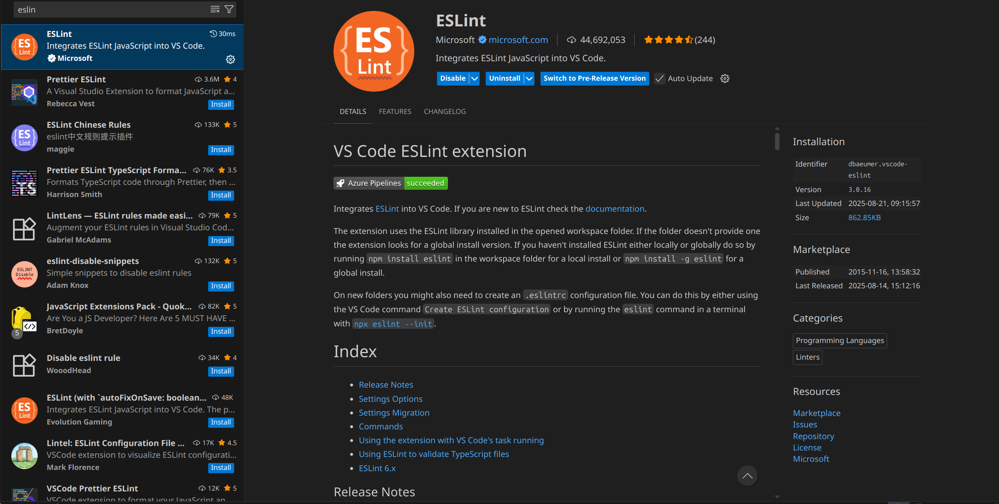

# ESLint

A tool that helps us find errors in javascript/typescript errors. For example you can set it up to throw an error if there are unused variable in a .mjs file and much more...

## What you NEED to do:

**Just install the VSCode extension** as shown below. I will set it up in our projects.



## If you want to know more:

There are two parts to make this work correctly:

1.  The pluggin the makes errors and warnings appear in the editor.
2.  The ESLint package that I will install and set up in the project using:

```bash
npm install @eslint/config@latest
```

Then I will use an **eslint.config.mjs** file to store the rules.

Below I include some guides on how I will do the configs.

- [How to set up eslint](https://youtu.be/eieTlMwCwWU?si=c5yVO3CSqCHPr_pE)
- [How the VSCode extension works](https://youtu.be/ycPl2NUFksg?si=fm2ld85mt2fKL8Qn)
- [ESLint docs](https://eslint.org/docs/latest/)
