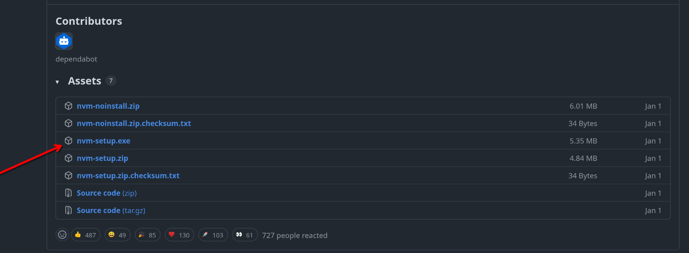

# Node.js and nvm

Node.js is a runtime environment that allows developers to run JavaScript code outside of the web browser, typically on servers or just on the console. Think of it as the replacement for python3.exe that we needed to run python scripts, or JDK for Java. Node.js also has npm (Node Package Manager), which is used to add packages in the project, example:

```bash
npm install react@latest
```

## What you NEED to do:

You need to Node.js installed in your computer. [Here](https://nodejs.org/en/download/) you can find the Node.js website but I don't recommend downloading it from the website directly.

The problem is that when you download the install executable it locks you in on a certain version of node. You get no updates and no multiple versions for different projects. To change version you need to uninstall Node and download a new "install.exe" den paleuete...

Luckuly some genius has created nvm (Node Version Manager), here is a quick guide(Windows only):

- Go [here](https://github.com/coreybutler/nvm-windows/releases)
- Click on the latest version(now 1.2.2)
- Scroll down and find **nvm-setup.exe**
  
- download and run it
- In the console run the command below, it should return the nvm version.

```bash
nvm -v
```

- Lastly, run this to install Node.js v22._._

```bash
nvm install 22
```

More [here](https://www.freecodecamp.org/news/node-version-manager-nvm-install-guide/)
