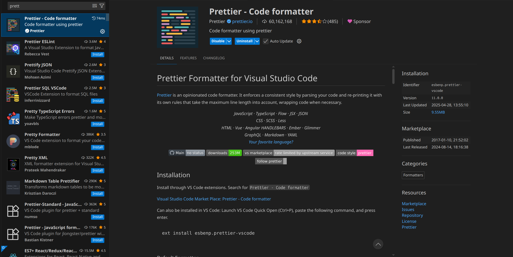

# Prettier

A tool to autoformat code -e.g, it removes excess spaces, empty lines and adds missing semicolons etc. It ensures code uniformity across all team members.

## What you NEED to do:

Install the VSCode extension. Make sure that you have enabled **format on save** and you have selected prettier as your **Default Formatter**.

If you don't know how to do these things see this [video](https://www.youtube.com/watch?v=eieTlMwCwWU).



## If you want to know more:

Prettier uses a prettierrc file store its configuration, in our projects I will set it up and we will pass it around through gitHub. Here is an example of prettierrc:

```json
tabWidth: 2
semi: true
```

This means that tab is 2 spaces and prettier will add missing semicolons automatically.
